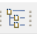
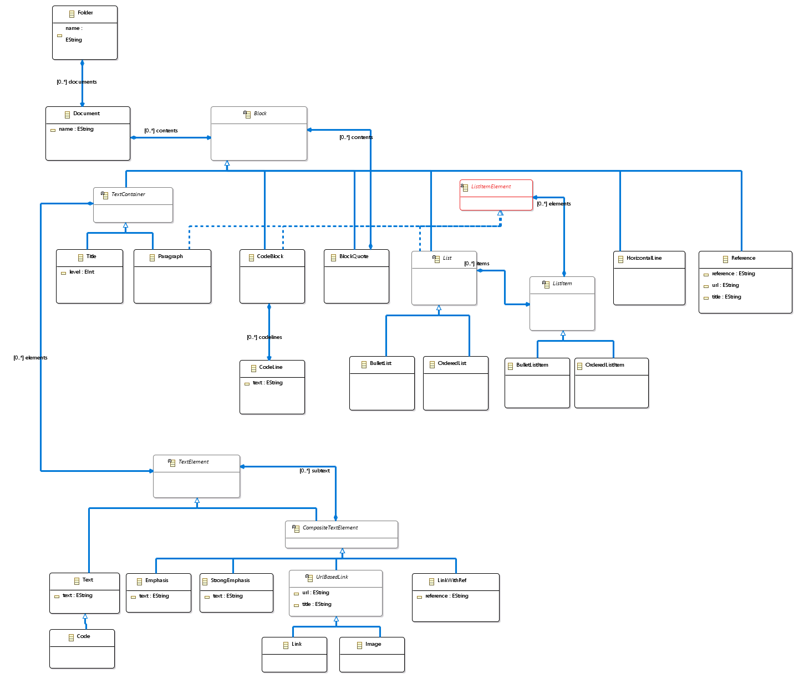
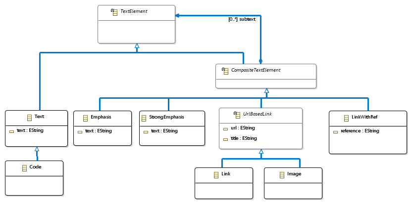
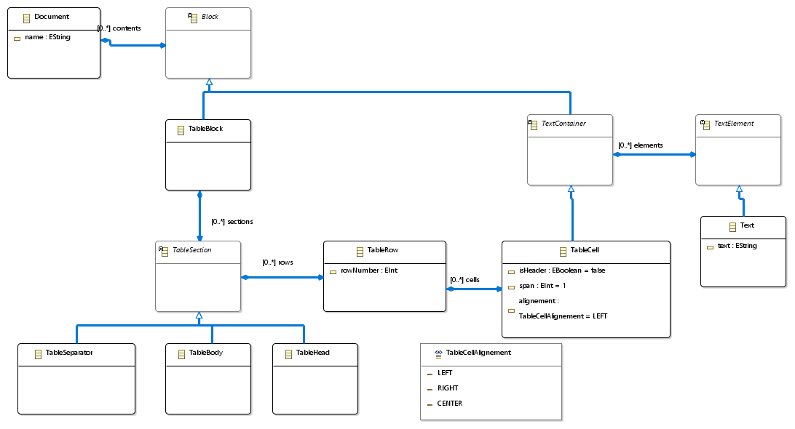
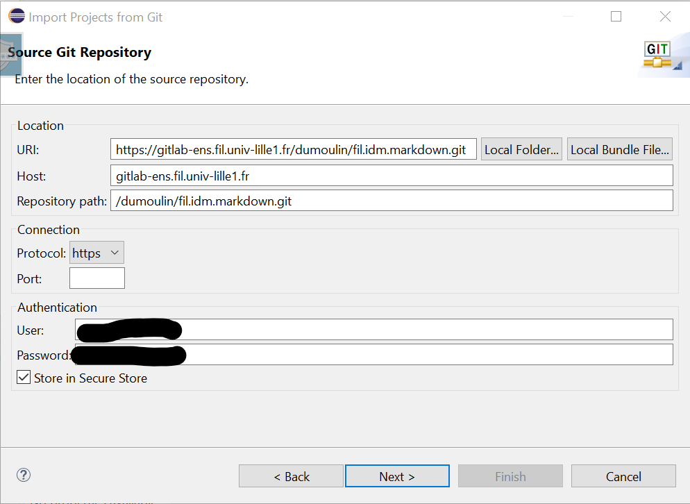
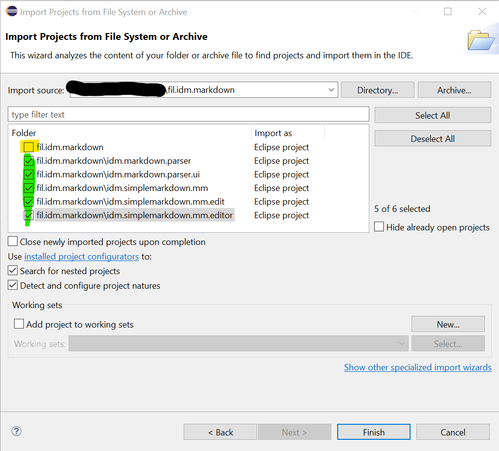

# Mardown file to Mardown Model converter

**Features :**
- A Markdown metamodel in EMF
- A Markdown file to Mardown model converter
- A UI allowing to run the tool from Eclipse menus

# Table of Content

[TOC]

# GIT repository

https://gitlab-ens.fil.univ-lille1.fr/dumoulin/fil.idm.markdown

# Usages

- Select one or more ``.md`` files, or a directory containing some ``.md`` files.
- ``Right Click -> Markdown -> Markdown Parser``
- Or click the icon  in toolbar.

**Warning:** If you have installed the Markdown converter by dowloading the projects, you should start the converter in a second Eclipse, started with ``Run As -> Eclipse Applicaton``.

# Markdown metamodel

## Main concepts


All concepts, except ``Folder`` are from the Markdown AST.
A Markdown document start with a ``Document``. A ``Document`` can contains ``Block``
which are ``Paragraph``, ``Title``, ``CodeBlock``, ``List``, ``BlockQuote`` ...
All this kind of concept start at the beginning of a line in the file.

A ``Paragraph`` and ``Title`` are composed of ``TextElement``, described later.

A ``List`` is composed of ``ListItem``. In Markdown file, list items start with ``-``or ``*``.
A ``ListItem`` can contains ``Paragraph``, ``Title``, ``CodeBlock``and ``List`` This elements are identified thanks to the ``ListItemElement``interface.

``CodeBlock`` is made of line of code that are normally left unchanged by Markdown renderers.

``BlockQuote`` can contains any elements a ``Document`` can contains.

## Text Concepts


In Markdown, nearly all lines of text are composed of ``Textelement``. A ``Textelement``can be
a ``Text``, an inline ``Code`` , a text in **strong** ``StrongEmphasis``, in *italic* ``Emphasis``. ``Links``, ``Image`` and link reference ``LinkWithRef`` are also ``TextElement``.


## Table Concepts



A Table contains 3 kind os sections : ``TableHead``, ``TableSeparator`` and ``TableBody``.
Each of this section contains ``TableRow`` describing a Row.
A row is made of ``TableCells``, which is of subclass of ``TextContainer``. So, a ``TableCelles``
can contains any Text.

# Markdown Files examples

Some examples in markdown can be found in ``/idm.markdown.parser/src/resources/md``

The following file is used to test the converter.
So, all the markdown constructions found in this file are recognized by the converter, and translated to the model.

**Test file :**

https://gitlab-ens.fil.univ-lille1.fr/dumoulin/fil.idm.markdown/-/blob/master/idm.markdown.parser/src/resources/md/tests.md

# Installation

Actually, the installation can only be done from sources.

## Prerequisites

- Eclipse Modeling (with EMF)


## Installation from sources

To install the tools, downloads all the projects from GIT and import them in an *Eclipse Workspaces*. Then the tools are availables in a second Eclipse launched with  ````Run As -> Eclipse Application````

### Install by importing GIT repository from Eclipse

Copy the GIT URL, then in your Eclipse workbench :
- ``Import... -> Git -> Projects from Git (with smart import)``
- ``Clone URI``
- Set GIT URI, User and Password
- 
- Choose master branch
- Select a location for the local git repo.
  - Avoid a location in the workbench tree
  - Prefer a separate location
  - Check imported projects, unsellect ``fil.idm.markdown`` (this is the root folder, not a project).
- 
- Finish

### Install from a zip file

- Download projects as a zip file
- Uncompress projects at the root of your Eclipse Workspace
- Open Eclipse
- ``Import ... -> General -> Existing Projects into Workspace``
- ``Select root directory``, Browse to the root directory where you have uncompressed your files
- 

# History
## 2020 12 11
- Change metamodel
  - ``StrongEmphasis`` and ``Emphasis`` are now subclasses of CompositeTextElemnts
- Add table capabilities
- Add ``RefLink`` and ``Reference``
-
## 2020 12 4
- Initial release
